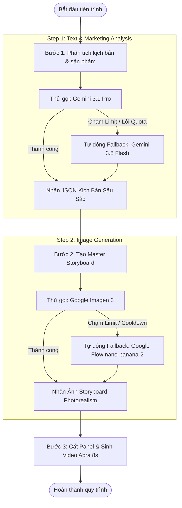

# Kế Hoạch Nâng Cấp 2 Model Gemini API & Cơ Chế Tự Động Fallback Khi Chạm Limit

## 1. Tổng Quan Mục Tiêu
Nâng cấp chất lượng kịch bản marketing và chất lượng hình ảnh sản phẩm trong toàn bộ hệ thống (`playwright-service`) bằng cách tích hợp 2 model cao cấp nhất từ tài khoản **Gemini Advanced (Paid tier)**:
1. **Model Phân Tích & Kịch Bản**: Nâng cấp lên **`Gemini 3.1 Pro`** (Thay thế mặc định `Gemini 3.8 Flash`).
2. **Model Sinh Hình Ảnh Storyboard**: Nâng cấp lên **`Google Imagen 3`** (Độ chân thực photorealism, render chữ thương hiệu chuẩn xác).

> [!IMPORTANT]
> **Cơ chế cốt lõi (Fail-Safe Fallback)**: Đảm bảo quy trình chạy tự động 24/7 **không bao giờ bị dừng**. Nếu bất kỳ model mới nào gặp sự cố, rate limit hoặc chạm trần hạn ngạch ngày (daily limit), hệ thống sẽ **ngay lập tức tự động chuyển về model hiện tại** (`Gemini 3.8 Flash` và Google Flow `nano-banana-2`).

---

## 2. Thiết Kế Kiến Trúc 2 Tầng (Primary ➔ Fallback)



---

## 3. Chi Tiết 2 Model Cần Nâng Cấp & Quy Tắc Fallback

### Model 1: Phân Tích Kịch Bản & Trích Xuất Dữ Liệu Sản Phẩm
* **Model Ưu Tiên (Primary)**: **`Gemini 3.1 Pro`**
  * *Ưu điểm*: Suy luận chuyên sâu (advanced reasoning), bóc tách chính xác từng thông số kỹ thuật phức tạp (lực hút 19.000Pa, lõi lọc HEPA 0.25µm, công suất 1000W), viết kịch bản 4 cảnh chạm đúng nỗi đau khách hàng, câu từ hấp dẫn, chuẩn quy tắc $\le 42$ từ.
* **Model Dự Phòng (Fallback)**: **`Gemini 3.8 Flash`**
  * *Kích hoạt khi*:
    - API trả về mã lỗi hạn ngạch (HTTP 429, Quota Exceeded, Resource Exhausted).
    - Session bị từ chối quyền Pro hoặc request timeout quá 30 giây.
* **Hành vi chuyển đổi**:
  - Ghi log: `[ModelFallback] ⚠️ Gemini 3.1 Pro gặp sự cố/limit -> Tự động chuyển sang Gemini 3.8 Flash`.
  - Thực hiện lại lượt phân tích bằng Flash ngay lập tức mà không làm đứt luồng công việc.

---

### Model 2: Sinh Hình Ảnh Master Storyboard (16:9) & Panels
* **Model Ưu Tiên (Primary)**: **`Google Imagen 3`** (qua Gemini Client)
  * *Ưu điểm*:
    - Độ chân thực như ảnh chụp điện thoại thật (iPhone 15 Pro) 100%, không bóng giả AI.
    - Render chữ thương hiệu sản phẩm (Typography) sắc nét, đúng chính tả tiếng Việt/tiếng Anh.
    - Tạo hình bàn tay 5 ngón, góc phòng khách chuẩn tỉ lệ và ánh sáng tự nhiên.
* **Model Dự Phòng (Fallback)**: **`nano-banana-2` (`NARWHAL`) trên Google Flow**
  * *Kích hoạt khi*:
    - Phát hiện phản hồi chạm trần limit ngày: `create more images as soon as your limit resets`, `image limit`, `quota`.
    - Phát hiện rate limit ngắn hạn (cooldown do gửi liên tục).
    - Lỗi kết nối hoặc timeout quá 60 giây khi sinh ảnh.
* **Hành vi chuyển đổi**:
  - Ghi log: `[ImageFallback] ⚠️ Imagen 3 chạm limit ngày -> Tự động chuyển sang Google Flow (nano-banana-2)`.
  - Gửi thông báo nhẹ về Telegram bot (nếu có bật Telegram logging).
  - Sử dụng ngay `executeGeneration` của Google Flow để sinh ảnh và tiếp tục tiến trình.

---

## 4. Các File Cần Thay Đổi (Khi Tiến Hành Triển Khai)

### 1. Cấu hình môi trường & hệ thống
* **`playwright-service/.env`** & **`playwright-service/config.json`**:
  - Bổ sung các biến cấu hình linh hoạt:
    ```env
    # Model phân tích kịch bản
    GEMINI_ANALYSIS_MODEL_PRIMARY=3.1-pro
    GEMINI_ANALYSIS_MODEL_FALLBACK=3.8-flash

    # Model sinh ảnh storyboard
    STORYBOARD_IMAGE_MODEL_PRIMARY=imagen-3
    STORYBOARD_IMAGE_MODEL_FALLBACK=nano-banana-2

    # Bật/Tắt cơ chế tự động Fallback
    ENABLE_AI_MODEL_FALLBACK=true
    ```

### 2. Client Gemini Backend (`playwright-service/services/gemini-client/gemini-api.js`)
* Thêm hỗ trợ tham số `modelTier` (`3.1-pro` hoặc `3.8-flash`) trong hàm `generateContent`.
* Bổ sung bộ nhận diện lỗi hạn ngạch chính xác:
  - `isDailyQuotaLimit(rawResponse)`: Nhận diện hết lượt tạo ảnh trong ngày.
  - `isRateLimitError(rawResponse, statusCode)`: Nhận diện nghẽn tốc độ ngắn hạn (HTTP 429).
* Tách module hàm `generateImageWithImagen3({ prompt, aspectRatio })` chuẩn hóa và có try/catch riêng.

### 3. Điều phối Storyboard (`playwright-service/services/template5-storyboard.js` & các templates)
* **Giai đoạn 1 (Analyze Product)**:
  - Bọc khối gọi `analyzeProductTemplate5` trong cơ chế retry & fallback: Gọi `3.1-pro` trước, nếu bắt gặp lỗi limit/auth thì tự động hạ cấp xuống `3.8-flash`.
* **Giai đoạn 2 (Master Storyboard Generation)**:
  - Bọc quy trình sinh ảnh:
    1. Kiểm tra cấu hình `STORYBOARD_IMAGE_MODEL_PRIMARY`.
    2. Nếu là `imagen-3`: Gửi prompt vào Gemini Web Client tạo ảnh.
    3. Nếu Imagen 3 thành công $\rightarrow$ Lưu ảnh `storyboard.png` và tiếp tục.
    4. Nếu Imagen 3 chạm limit / lỗi $\rightarrow$ Kích hoạt ngay Fallback: chuyển sang gọi Google Flow (`nano-banana-2`) sinh ảnh như bình thường.

---

## 5. Kế Hoạch Xác Minh & Kiểm Thử (Verification Plan)

### Kịch bản 1: Kiểm thử chạy bình thường với 2 model mới (Happy Path)
1. Chạy phân tích sản phẩm $\rightarrow$ Xác minh log trả về xác nhận sử dụng `Gemini 3.1 Pro`.
2. Chạy sinh ảnh Master Storyboard $\rightarrow$ Xác minh ảnh được tạo bởi `Imagen 3` thành công, lưu file vào thư mục run.

### Kịch bản 2: Giả lập Limit để kiểm thử Fallback Text (3.1 Pro ➔ 3.8 Flash)
1. Giả lập lỗi trả về Quota Limit ở model 3.1 Pro.
2. Kiểm tra xem hệ thống có log thông báo fallback và tự động nhận kết quả từ 3.8 Flash hay không.
3. Kiểm tra kết quả JSON cuối cùng có đầy đủ 4 cảnh hay không.

### Kịch bản 3: Giả lập Limit để kiểm thử Fallback Image (Imagen 3 ➔ Google Flow)
1. Giả lập chuỗi phản hồi `limit resets` ở bước sinh ảnh Imagen 3.
2. Kiểm tra xem hệ thống có tự động kích hoạt hàm gọi Google Flow `executeGeneration` với model `nano-banana-2` hay không.
3. Xác minh tiến trình video phía sau vẫn cắt 4 panel và sinh 2 video 8s bình thường mà không bị crash.

---

## 6. Trạng Thái Hiện Tại
* [x] Đã khảo sát và kiểm chứng thực tế khả năng chạy của `Gemini 3.1 Pro` trên tài khoản.
* [x] Đã kiểm chứng thực tế sinh ảnh thành công bằng `Imagen 3` trên tài khoản.
* [x] Lập tài liệu kế hoạch chi tiết (File này).
* [ ] **Chưa implement code** (Đang chờ bạn duyệt kế hoạch trước khi bắt đầu).
